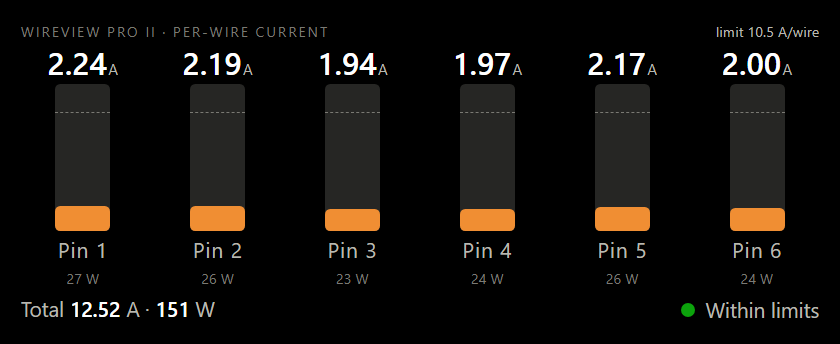
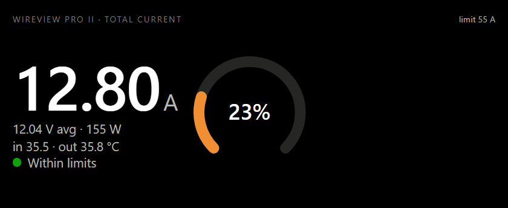
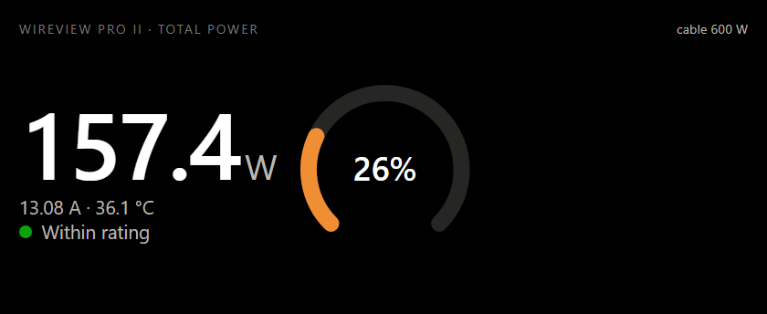

# WireView Pro II widgets for the Corsair Xeneon Edge

Live **per-wire current**, **total current** and **total power** from a
[Thermal Grizzly WireView Pro II](https://www.thermal-grizzly.com/en/wireview-pro-ii-gpu/s-tg-wv-p2-h19n)
on a [Corsair Xeneon Edge](https://www.corsair.com/us/en/s/xeneon-edge), through iCUE's built-in
**iFrame** widget.

| Per-wire current | Total current | Total power |
|---|---|---|
|  |  |  |

The widgets are plain HTML pages. A tiny **bridge** on the same PC reads the WireView
**straight over USB serial** and serves the readings as JSON on `http://localhost:8765`, and
serves the widget pages too. No HWiNFO, no Thermal Grizzly app; nothing leaves the machine,
and only the widget pages (the bridge's own origin and the GitHub Pages copy) may read the
JSON from a browser.

The bridge is a single executable, `wireview-bridge.exe`, written in Rust. It needs no runtime
and no other files: the widget pages are built into it. (Releases up to 1.0.1 were Python; the
JSON and the bridge authentication are unchanged, so old and new programs work together.)

## Install

One command, in PowerShell:

```
powershell -ExecutionPolicy Bypass -c "irm https://raw.githubusercontent.com/jlobue10/wireview-xeneon-edge/main/install.ps1 | iex"
```

It downloads `wireview-bridge.exe` from the latest release to
`%LOCALAPPDATA%\wireview-xeneon-edge`, checks its SHA-256, registers a per-user Scheduled Task
named "WireView Bridge" that runs the bridge at logon (no admin rights needed), and starts it.
A Python-based 1.x install in that folder is replaced. Then:

1. **Close the Thermal Grizzly WireView app** and turn off its auto-start. Only one program
   can hold the WireView's USB serial port.
2. Check <http://localhost:8765/api/wireview> shows `"ok": true`.
3. In iCUE select the Xeneon Edge, add an **iFrame** widget in the slot you want, and paste
   one of:
   - `http://localhost:8765/per-wire/`
   - `http://localhost:8765/total-current/`
   - `http://localhost:8765/total-power/`

   Append query options to match your limits, e.g.
   `http://localhost:8765/per-wire/?wire_limit=10.5&total_limit=55`.

Re-running the installer updates the executable and restarts the bridge. It leaves a copy of
itself next to the executable, so `%LOCALAPPDATA%\wireview-xeneon-edge\install.ps1 -Uninstall`
removes the executable and installer while preserving any files you added.

For an older custom install without an ownership marker, pass `-Uninstall -Dir <install folder>`.
In-place source or manually downloaded folders keep their files when no `-Dir` is given.

The executable is not code-signed, so SmartScreen or an antivirus may flag it as unknown on
first run; some products (Norton, for one) quarantine it outright. Check the SHA-256 and the
attestation below, then allow it or add `%LOCALAPPDATA%\wireview-xeneon-edge` to the exclusions.
Tested on Windows 11 with a WireView Pro II on firmware v5 and iCUE 5.

The installer fetches the latest tagged release, prints the executable's SHA-256 and compares it
with the release's `SHA256SUMS`. If the release lookup fails it stops rather than installing
something else. That comparison only catches a damaged download, because the list comes from the
same place as the file.

The one-liner above runs whatever `install.ps1` is on `main` today. To install exactly what you
reviewed, fetch the bootstrap from the same tag and pass the hash from that release's notes:

```
powershell -ExecutionPolicy Bypass -c "& ([scriptblock]::Create((irm https://raw.githubusercontent.com/jlobue10/wireview-xeneon-edge/v2.1.2/install.ps1))) -Ref v2.1.2 -Sha256 <hash>"
```

Fully verified, with no remote code before the check: download `wireview-bridge.exe` and
`install.ps1` from the release page into one folder, compare the hash with the release notes,
and run the installer there (it then installs in place):

```
(Get-FileHash wireview-bridge.exe).Hash        # must equal the hash in the release notes
gh attestation verify wireview-bridge.exe --repo jlobue10/wireview-xeneon-edge   # optional: built by this repository's workflow
powershell -ExecutionPolicy Bypass -File install.ps1
```

`-NoStart` registers without starting; `-ExtraArgs '--port 9000'` passes options to the bridge.

<details>
<summary>Build from source</summary>

With [Rust](https://rustup.rs) installed:

```
cargo build --release -p wireview-bridge
target\release\wireview-bridge.exe
```

Copy `install.ps1` next to the executable and run it to register the task in place.
</details>

## How it works

```
WireView Pro II ──USB serial (COMx, 115200 8N1)──▶ wireview-bridge.exe ──localhost JSON──▶ widget page in iCUE iFrame
```

The code is a Cargo workspace: `crates/wireview-core` is the reader, shared with
[wireview-nexus](https://github.com/jlobue10/wireview-nexus); `crates/wireview-bridge` is the
HTTP server.

- `wireview-core/src/serial.rs` speaks the WireView's serial protocol, as recovered by the Linux
  community projects [wireview-pro-ii](https://github.com/Gustav0ar/wireview-pro-ii)
  (`docs/protocol.md`) and [wireview-hwmon](https://github.com/emaspa/wireview-hwmon). Only
  read-only commands are used (vendor data, UID, build info, sensor values) plus "resume
  display updates". The 100-byte sensor frame carries per-pin voltage/current/power, totals,
  average voltage, in/out and two external temperatures, fan duty, the cable's power rating
  and both fault masks.
- `wireview-core/src/source.rs` picks the reader. `--source auto` (default) opens the COM port
  directly and falls back to HWiNFO64 shared memory (`hwinfo.rs`, HWiNFO 8.41+ with Shared
  Memory Support) only while the port is unavailable. `--source serial` / `hwinfo` force one;
  `--serial-port COM5` overrides auto-detection by USB ID 0483:5740.
- While the bridge holds the port, HWiNFO's own WireView sensor stops updating; it resumes
  when the bridge exits.
- The HWiNFO reader needs Total Current, Total Power and all six Pin Current values enabled
  under the WireView sensor; if any is hidden, the widgets show "Incomplete readings" instead
  of a healthy display with blanks.
- The bridge also serves the widget pages, so `http://localhost:8765/per-wire/` works without
  GitHub Pages. They are compiled into the executable from `docs/`, so serving them never
  touches the file system; `--static-dir <folder>` serves your own copies instead, confined to
  that folder. Cross-origin reads of the JSON are allowed only from the bridge's own loopback
  origin and `https://jlobue10.github.io`; add others with `--allow-origin`. Requests whose
  `Host` header is not a loopback name are refused (DNS rebinding), and the device's hardware
  UID is never served, so a random website open in your browser cannot read or fingerprint the
  device. Everything else on the PC (the Nexus daemon, `curl`) reads it freely.
- Programs that share the device through the bridge can check they are talking to the real
  bridge and not to whatever else grabbed the port: append `?nonce=<hex>` and the reply carries
  `X-WireView-Auth`, an HMAC-SHA256 over `nonce.body` keyed with a random per-user secret in
  `%LOCALAPPDATA%\wireview\bridge.secret` (created on first start). wireview-nexus does this and
  ignores any bridge that fails the check. The bridge also refuses to start if either loopback
  address is already taken, so a stray listener cannot silently receive half the traffic.
- Readings older than five seconds are reported as "Stale readings" rather than shown as OK,
  both by the bridge and by the widgets.
- At most 32 connections are served at once, and a connection that has not sent its request
  within ten seconds is dropped.

**Which URL in iCUE?** The same pages are hosted at
<https://jlobue10.github.io/wireview-xeneon-edge/>, but that is an https page reaching into
`localhost`. Chromium 138+ classifies that as a Local Network Access request and asks for
permission; an embedded webview may deny it silently and the widget shows "Bridge offline".
Served from the bridge, page and data share one origin and nothing can block it. iCUE 5.51
bundles Chromium 130, which predates the rule, so the hosted URLs also work today; the
localhost form is simply future-proof.

## URL options

| Option | Default | Meaning |
|---|---|---|
| `host` | Current origin for local pages; `http://localhost:8765` for hosted pages | Bridge origin |
| `wire_limit` | `10.5` | Amps per wire treated as 100 % (per-wire widget) |
| `total_limit` | `55` | Amps total treated as 100 % (total-current widget) |
| `cable_w` | cable's own rating | Cable rating in W (total-power widget); the WireView reports 600/450/300/150 |
| `decimals` | `2` | Decimals on the headline numbers |
| `interval` | `1000` | Poll interval in ms, clamped to 250–60000; stale detection runs independently |
| `accent`, `bg`, `fg` | orange / black / white | Hex colours without `#` |
| `label=0` | | Hide the caption line |

Warning colour begins at 80 % of a limit, critical at 100 %. The device's own fault flags
(over-current, wire over-current, over-power, chip/sensor over-temperature, current imbalance)
always show as critical with their name.

The pages size themselves with `vmin` units and were checked at every Xeneon Edge slot size
(840×344, 840×696, 1688×696, 2536×696 and the vertical 696×416 … 696×2536).

## Bridge API

`GET /api/wireview`

```json
{
  "ok": true, "source": "serial", "device_found": true, "poll_time": 1790473743.8, "age_s": 0.0,
  "device": {"port": "COM5", "fw": 5, "build": "TG-WV-PRO2-FW_20260430_1838"},
  "pins": [{"n": 1, "voltage": 12.04, "current": 2.22, "power": 26.7}, "... 6 entries"],
  "total_current": 12.49, "total_power": 150.4, "avg_voltage": 12.04,
  "temp_in": 35.5, "temp_out": 35.8, "temp_ext": [null, null], "vdd": 3.417, "fan_duty": 0,
  "cable_w": 600,
  "faults": {"temp_chip": false, "temp_sensor": false, "over_current_total": false,
             "over_current_wire": false, "over_power": false, "imbalance": false},
  "faults_logged": {"...": "same keys, latched since last clear"}
}
```

When there is no reading, `ok` is false and `status` / `hint` say why (for example
`"COM port busy"` / `"close the WireView app (and HWiNFO)"`). `GET /api/health` returns
`{"ok":true}`. `served_at` is when the bridge produced the reply; with `?nonce=<hex>` the
`X-WireView-Auth` header authenticates it (see above). Options: `--port`, `--bind`,
`--no-static`, `--static-dir`, `--source`, `--serial-port`, `--allow-origin`, `--version`.
`--bind` other than loopback exposes the readings and widgets to that network and turns the
`Host` check off; leave it at the default unless you mean that. Set `WIREVIEW_BRIDGE_LOG=1` to
log each request.

## Tests

`cargo test --workspace` runs the regression checks for the access model (CORS, Host, HMAC,
static containment, worker cap, IPv6 collision, deadlines, freshness, non-finite values, HWiNFO
block bounds) on Windows, Linux or macOS with stubs; no hardware needed. The tests run one at a
time (`.cargo/config.toml`), because some antivirus drivers stall a parallel run; the bridge
itself is not affected.
`cargo run -p wireview-core --example read` prints one reading as JSON.

## Companion project

[wireview-nexus](https://github.com/jlobue10/wireview-nexus) shows the same readings on a
Corsair iCUE Nexus, which cannot display web content, by driving the panel directly. When
both run on one PC the Nexus daemon reads from this bridge, so the two never fight over the
COM port. It builds against the `wireview-core` crate of this repository.

## License

MIT. WireView serial protocol details from wireview-pro-ii and wireview-hwmon (MIT). The
executable includes the Rust crates listed in `Cargo.lock` under their own licenses (MIT,
Apache-2.0, and MPL-2.0 for `serialport`).

`node --test tests/widget.test.cjs` checks widget polling, stale detection and custom ports.
After `cargo test`, `pwsh -NoProfile -File tests/installer.test.ps1` checks installation and
uninstallation in temporary directories with Windows administration and downloads mocked.

Audit findings and the remaining hardware checks are recorded in [AUDIT-2026-09-30.md](AUDIT-2026-09-30.md).
